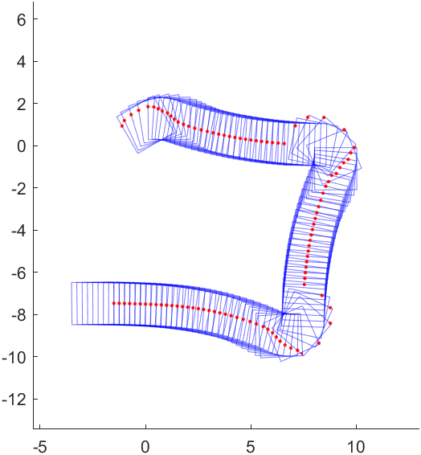
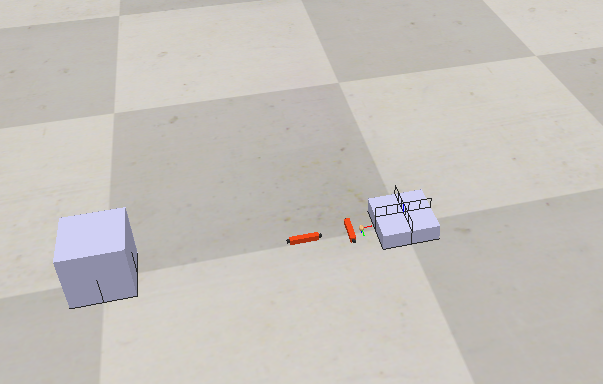

<!--
 * @Author: error: error: git config user.name & please set dead value or install git && error: git config user.email & please set dead value or install git & please set dead value or install git
 * @Date: 2023-02-18 20:21:53
 * @LastEditors: error: error: git config user.name & please set dead value or install git && error: git config user.email & please set dead value or install git & please set dead value or install git
 * @LastEditTime: 2023-03-01 17:17:56
 * @FilePath: \simulation_push\README.md
 * @Description: 这是默认设置,请设置`customMade`, 打开koroFileHeader查看配置 进行设置: https://github.com/OBKoro1/koro1FileHeader/wiki/%E9%85%8D%E7%BD%AE
-->

# simulation_push
 
非抓握操作(Nonprehensile Manipulation)-push的仿真，仿真对象为一个正方形的方块，使用单个（支持多个）接触点进行操作，操作过程中摩擦状态可以在固定，向上滑动，向下滑动中切换。数值仿真使用四阶龙格库塔法，差分动力学模型参考[1]。在数值仿真的基础上，基本实现了基于混合整数规划求解器Gurobi的MPC控制，使用了yalmip进行MPC问题的建立，并尝试了接触边切换控制。在CoppeliaSim中搭建动力学场景，进行了控制器的验证，在仿真中控制器部分采用通讯-控制双线程模式，避免互相干扰。所有代码都在matlab中实现。

数值计算改进方向：
1、被推动物体的动态参数（惯性参数和外力约束等）的变化与辨识
2、多个接触点
3、加入噪声和干扰
4、接触点可以在空中，但是有过渡过程

[1] Hogan F R. Reactive manipulation with contact models and tactile feedback[D]. Massachusetts Institute of Technology, 2020. 